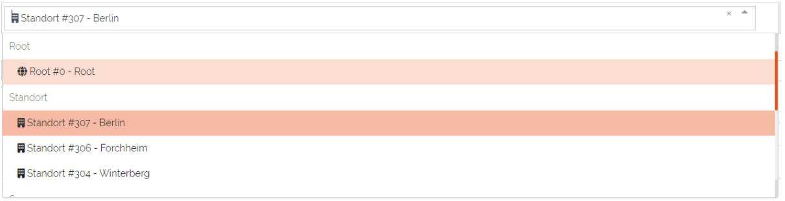
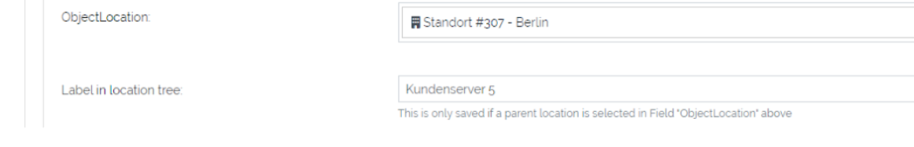
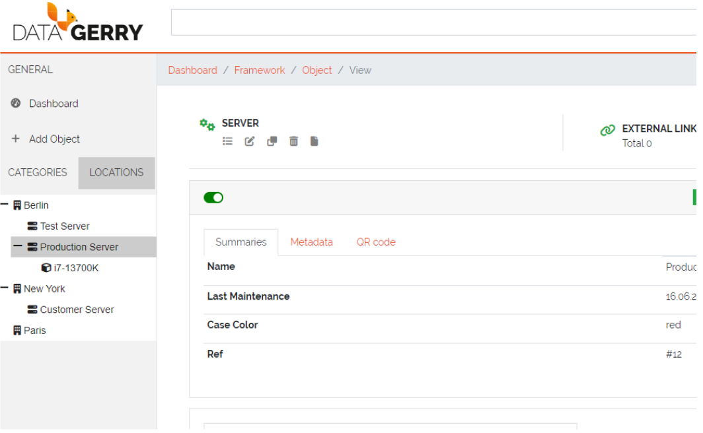

*****************
Advanced Concepts
*****************
This section contains an overview of advanced topics for managing **Objects** and **Types** in DATAGERRY.

=======================================================================================================================

| 

=======================================================================================================================

.. _section-templates-anchor:

Section Templates
=================
Section templates allow users to create custom sections and insert them via drag-and-drop in type configurations.
This is particularly useful when the same group of fields (a section) is used for different **Types**. Section
templates speed up the creation and modification of types, eliminating the need to repeatedly
create recurring sections.

Section templates can be accessed at the top right corner at **Framework => Section Templates**.

.. figure:: img/section_templates_systemlink.png
    :width: 200
    :alt: Accessing Section Templates

    Picture: Accessing Section Templates

=======================================================================================================================

| 

=======================================================================================================================

Section Templates Overview
--------------------------
In the Section Templates overview all created templates are displayed with their PublicID, Name, Type and 
the corresponding actions. At the top left corner of the table is the “Add”-Button with which new section
templates can be created.

.. figure:: img/section_templates_overview.png
    :width: 700
    :alt: Section Templates overview

    Picture: Section Templates overview

| 

=======================================================================================================================

| 

Creating Section Templates
--------------------------
In this form a section template can be built the same way as in type configurations by drag and drop of elements
from the “Controls”-Sidebar into the “Fields”-area of the section. The only control that is not available to
section templates is the special control **Location** since a type can only have one of these controls and is
therefore only setable directly in the type configuration. Additionally there is a checkbox in the section header
where the template can be defined as a **Global** section template, this can not be changed when editing a section
template. If the checkbox remains unchecked the created section template will be of type **Standard**.

.. figure:: img/section_templates_creation.png
    :width: 700
    :alt: Creation of Section Templates

    Picture: Creation of Section Templates

| 

=======================================================================================================================

| 

Using Section Templates
-----------------------
After a section template has been created it can be used in type configurations. In the sidebar of the type
configuration are two areas, the **Global Section Templates** area  which contain all global and predefined
section templates and the **Section Templates** area which contains all Standard section templates. They can
be added to the type configuration via drag and drop the same way a new section would be added. **Global
Section Templates** are not editable inside the type configuration.

.. figure:: img/section_templates_usage.png
    :width: 700
    :alt: Using section templates in type configuration

    Picture: Using section templates in type configuration

| 

=======================================================================================================================

| 

Section Template Types
----------------------
There are three different types of templates each with a specific purpose. Below is an overview of the
characteristics of each section template type.

| 

Standard Section Templates
^^^^^^^^^^^^^^^^^^^^^^^^^^
- It can be dropped multiple times inside the same type configuration
- After it is dragged inside the type configuration it can be further modified and additional fields can
  be added or existing ones can be deleted
- It can be converted into a **Global Section Template**
- Changing a standard section template in the template configuration won't affect already used instances of it
- There is no programatical connection between the **Standard Section Template** and the type

| 

Global Section Templates
^^^^^^^^^^^^^^^^^^^^^^^^
- It can be dropped only once inside the same type configuration
- It can not be further modified after it was added to a type configuration
- Changes to the global section template in the template configuration will affect all existing instances
  of the template

  - **Example 1:** Adding a field will add the new field to all existing instances of this template
  - **Example 2:** Removing a field will also remove this field from all existing instances of this 
    template (the stored value is lost)
  - **Example 3:** Deleting a global section template will also delete the section and its data from all types and
    objects which are using it

- Types are tracking all of their used **Global Section Templates**

| 

Predefined Section Templates
^^^^^^^^^^^^^^^^^^^^^^^^^^^^
- They have the same characteristics as **Global Section Templates** but are delivered by DATAGERRY
- They are not editable or deletable by the user
- Users can create a clone of **Predefined Section Templates** but the clone will no longer be considered
  as a predefined section template

| 

=======================================================================================================================

| 

Section Templates - Table Actions
---------------------------------
There are different actions for created section templates depending on the template type. Below is an overview
and explanation of each.

.. figure:: img/section_templates_table_actions.png
    :width: 300
    :alt: Actions for created section templates

    Picture: Actions for created section templates

| 

**Open Preview** |action_preview_img|

.. |action_preview_img| image:: img/section_templates_table_action_preview.png
    :width: 20
    :alt: Open Preview

Opens a preview of the section template which will display how the created section and its fields will look like.

| 

**Edit Section Template** |action_edit_img|

.. |action_edit_img| image:: img/section_templates_table_action_edit.png
    :width: 20
    :alt: Edit Section Template

Redirects the user to the edit form for the section template. This action is not available for predefined templates.
Editing a global section template in this form will affect all types and objects using this template.

| 

**Clone Section Template** |action_clone_img|

.. |action_clone_img| image:: img/section_templates_table_action_clone.png
    :width: 20
    :alt: Clone Section Template

With this action users can create a clone of an existing template(even a predefined template). A popup will open
where the name and the type of the template can be set. After confirmation the clone will be created.
A cloned predefined template is either of type standard or global.

| 

**Transform Standard Template** |action_transform_img|

.. |action_transform_img| image:: img/section_templates_table_action_transform.png
    :width: 20
    :alt: Transform Standard Template

A standard template can be transformed into a global section template by pressing this action. When the template
is transformed it is seen as a new global section template which means that the previous uses of this standard
template on types are not tracked. Users should consider that this action can not be undone. This action is only
available to standard templates.

| 

**Global Template Indicator** |action_global_img|

.. |action_global_img| image:: img/section_templates_table_action_global.png
    :width: 20
    :alt: Global Template Indicator

This is just an indicator that this template type is **Global** and should represent that this type can not be
transformed. All predefined templates are also global templates.

| 

**Delete Template** |action_delete_img|

.. |action_delete_img| image:: img/section_templates_table_action_delete.png
    :width: 20
    :alt: Delete Template

With this action section templates can be deleted. Consider that deleting a global section template will also
remove it and all set values from types and objects. The amount of affected types and objects will be displayed
in the confirmation popup. Predefined templates are not deletable.

| 

=======================================================================================================================

| 

Section Templates - Rights
--------------------------
The section for managing **Section Templates** has its own set of rights.

| 

**base.framework.sectionTemplates.\***

This right grants all the rights mentioned below and allows the user to do everything with section templates.

| 

**base.framework.sectionTemplates.view**

This right is required to access the section templates via **Framework => Section Templates**. Furthermore it 
is required for the **Open Preview** action.

| 

**base.framework.sectionTemplates.create**

This right is required to create new section templates. Together with **base.framework.sectionTemplates.edit**
it is required to clone templates.

| 

**base.framework.sectionTemplates.edit**

This right is required to edit existing section templates. Together with **base.framework.sectionTemplates.create**
it is required to clone templates.

| 

**base.framework.sectionTemplates.delete**

This right is required to delete existing section templates. Predefined section templates are not deleteable.

=======================================================================================================================

| 

=======================================================================================================================

.. _multi-data-sections-anchor:

Multi Data Sections (MDS)
=========================
**Multi Data Sections** enable users to create a group of fields (a section) within the **Type Configuration**,
allowing the storage of multiple value sets. These value sets are displayed and managed in a table format.

| 

    Picture: **Multi Data Section** vs **Section**

.. warning::
  * At the current state of development there are some restrictions to MultiDataSections of which some are intended
    and some will be implemented in later releases

    * Objects with MDS can only be exported/imported in JSON format
    * MDS entries cannot be used in the DocAPI
    * MDS entries do not interact with exportd
    * MultiDataSections are not displayed in bulk changes
    * MDS fields cannot be used as summary fields in the type configuration

=======================================================================================================================

| 

=======================================================================================================================

Adding MDS to Types
-------------------
Before we can add a **MultiDataSection** to a **Type** we first need to go to **Framework => Types** and open the
**Type Configuration** of an existing **Type** or create a new **Type**. Inside the **Type Configuration** we need to
switch to the **Content** - step where we will find the Structure Control **“Multi Data Section”** in the left
sidebar. It can be dragged and dropped into the type like all other elements of the sidebar.

You can include multiple MDS in a single **Type**.

| 

.. figure:: img/mds_structure_control.png
    :width: 300

    Picture: Structure Control - **Multi Data Section**

| 

=======================================================================================================================

| 

Adding Fields to MDS
--------------------
After the **MultiDataSection** was dropped in the **Type**, we can drag and drop fields from the **Basic** and
**Special Controls** (except “Location”). Fields which are dropped into a **MultiDataSection** will have an additional
checkbox at the top (**“Hide this field as column in object view/edit mode”**). By checking this checkbox it is
possible to remove fields from the table overview, which can be useful to keep the table compact by just displaying
the relevant data. When creating or editing an entry for the **MultiDataSection** these fields will still be visible
in the popup forms.

Once all necessary fields are added to the **Multi Data Section**, you can save the type configuration.

| 

    Picture: Adding fields to a **Multi Data Section**

| 

=======================================================================================================================

| 

Adding Objects with MDS
-----------------------
When creating a new **Object** of a **Type** with a **MultiDataSection** all fields (except the fields which were
marked as hidden in the **Type Configuration**) of the corresponding **MDS** will be displayed as table headers with
an additional header **“Actions”** where the entries can be modified. To add a new entry press the **“+Add”** - button
in the top left corner of the table. 

.. warning::
  * **Saving**: Changes to **MultiDataSections** are only saved in the backend when the **Object** itself is saved.

| 

    Picture: Adding objects with **Multi Data Sections**

| 

A popup will be displayed where values for all fields (also the fields which are marked as hidden for the table
overview) can be filled out. After pressing the **“Add”** - Button the entry will be created in the MDS-table.
This process can be repeated to create multiple entries. 

| 

    Picture: Adding an entry to a **Multi Data Section**

| 

All created entries will be displayed in the table with pagination for more than 10 entries, and each entry will
have **"Actions"** such as Preview, Edit, and Delete.

.. note::
 - **Preview**
    
   Displaying the current values of the entry in a popup

 - **Edit**
    
   The current values of the entry are loaded in a popup form where they can edited

 - **Delete**
    
   The corresponding entry will be deleted (a confirmation popup will be shown)

| 

    Picture: Multiple entries in a **Multi Data Section**

=======================================================================================================================

| 

=======================================================================================================================

.. _locations-anchor:

Locations
=========
**Locations** give users the possibility to structure their objects in a tree like shape where the top elements are for
example a country or a city and the sub elements are something like offices, rooms, servers etc. This will enhance the
overview as well as give the possibility to quickly find an object. The location tree can be found in the sidebar
inside the “LOCATIONS”-Tab.

.. figure:: img/locations_sidebar.png
    :width: 200
    :alt: Locations tab in sidebar

    Picture: Locations tab in sidebar

=======================================================================================================================

| 

=======================================================================================================================

Initialise Location-Functionality for a Type
--------------------------------------------
In order to display **Objects** in the Locations-Tab the corresponding **Type** needs to have assigned the Special
Control **Location** in it's type configuration. To do this open the type overview via **Framework => Types** in the
top right corner and press the **Edit**-Icon from the **Actions**-column for the **Type** which should get the
**Locations** functionality. 

In the type configuration switch to the **Content**-Tab and on the left side in **Special Controls** drag the
**Location**-Control inside the fields-area of a section.

.. note::
  A **Location-Control** can only be assigned once to a **Type**.

.. figure:: img/locations_special_control.png
    :width: 700
    :alt: Location control in type configuration

    Picture: Location control in type configuration

The **Location**-Control contains two fields, “Label” and “Selectable as Location”. The “Label” is used in the object
overview to identify the location field and the “Selectable as Location” defines if this type can be used as a top
location for other objects .This is useful if you have a type where you don't want the have any objects below it,
for example you have a **Type** Server and a **Type** Processor. The server is the top location for the processor but
the processor can not be the top location for any other **Types**.

| 

=======================================================================================================================

| 

Configure a Location for an Object
----------------------------------

After the **Location**-Special Control has been added to the **Type**(see previous step) switch to the object overview
of an **Object** of this **Type**. The **Location**-Special Control added two fields to the **Object**. The first is
the location selection named after the "Label" which was set in the type configuration. In this field the top location
for this **Object** can be selected.The drop down list contains always the **Root**-Location which is the top most
**Location** possible. Furthermore the drop down will also contain all **Objects** which have a **Location** selected
(but not **Objects** which are directly below the current object in the **Location Tree**).

    Picture: Selection of top location for current location

| 

The second added field "Label in location tree" is used to set the name of this **Object** when displayed in the
**Location tree**.

    Picture: Added fields to **Object** from **Location**-Special Control

| 

When the top location is selected and the **Object** is saved it will appear in the **Locations**-Tab in the sidebar.
Each **Object** in the **Locations**-Tab can be clicked and will open the object overview of the selected **Object**.

    Picture: **Locations** in the **Locations**-Tab

=======================================================================================================================

| 

=======================================================================================================================

.. _access-control-anchor:

Access Control
==============
Datagerry uses multiple access controls to restrict the access to data and functions.
In addition to the :ref:`system-access-rights`. implemented by default at the user management level,
there is also the concept of the access control list. These are currently only implemented for the object level,
but will be extended to various sections of the core framework.
They should provide more precise setting options for accesses within already authorized levels/functions.

=======================================================================================================================

| 

=======================================================================================================================

Access Control List
-------------------
The concept of ACL is basically very simple. They are, as the name suggests,
lists that have group references with certain permissions. In our case, the user group is stored there.
So if a user wants to get access via an ACL, this is only possible if the complete user group is listed in the ACL.
The permissions define which actions are granted to a group within an ACL.
This allows different operations to be defined even more precisely.

| 

Permissions
^^^^^^^^^^^
By default, four permissions are possible:

- **Create** a resource
- **Read** a resource
- **Update** a resource
- **Delete** a resource

based on the four basic functions of persistent storage.
Further permissions can theoretically be added, but these are not planned at the moment.

| 

ACL vs. System-Rights
^^^^^^^^^^^^^^^^^^^^^
The difference between the system rights and the ACL is that the ACL only improves the system rights
and makes the accesses more detailed. They are **not a replacement** for the rights, they only extend the restrictions.
Groups that do not have rights for certain actions (for example: viewing an object) cannot do this,
even if their group is explicitly listed in the respective ACL.

| 

=======================================================================================================================

| 

Object ACL
----------
The ACLs of the objects protect them from unauthorized access.
They are used to make objects accessible to certain user groups or to hide them.
This affects not only the view of the objects themselves, but any aspect of CRUD access to objects,
up to and including search, export, etc.

In principle, there are five different access situations to objects.

.. csv-table:: Table 3: Access situations
   :header: "Configuration", "Access"
   :width: 100%
   :widths: 50 50
   :align: left

   "No ACL defined", "Everyone has access to objects of this type"
   "ACL deactivated", "Everyone has access to objects of this type"
   "ACL enabled, but group not included", "No access to objects of this type"
   "ACL enabled and group included, but not the grant permission of the operation", "No access to objects of this type"
   "ACL enabled and group included and grant permission of the operation", "User group has access to objects of this type"

**Why additional protection of objects?**

Datagerry instances can be defined large and complex. In many companies there are different hierarchies and access
restrictions to different information areas. Until now, DATAGERRY only offered the possibility to give groups
general read/view rights to objects, but not to make individual groups of objects visible only to certain user groups.
Here the ACL help to restrict or allow the visibility of object information for certain user groups
depending on the configuration.

| 

Configure Object ACL
^^^^^^^^^^^^^^^^^^^^
Object ACL are defined in the respective type definitions via the type builder.
These can be defined under the ACL step based on the type. By default, they are disabled and the menu is excluded.

.. figure:: img/object_type_builder_acl_protected.png
    :width: 600
    :alt: Deactivated object acl

    Figure 20: Deactivated object acl

When activated, the menu is enabled and groups can be added to an ACL with the respective permissions.

.. figure:: img/object_type_builder_acl_setup.png
    :width: 600
    :alt: While object acl configure

    Figure 21: While object acl configure

After adding the groups, they are displayed in the list below and their permissions can be edited further.
But a group can only appear once in an ACL.
Listing the same group with different permissions in the same list is not possible.

.. figure:: img/object_type_builder_acl_example.png
    :width: 600
    :alt: Inserted object acl

    Figure 22: Inserted object acl

The ACL settings are retained at the object level even after the ACL is disabled, but then they are no longer applied.

| 