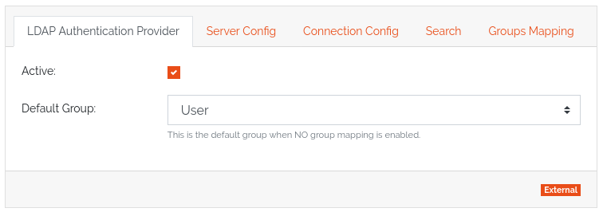
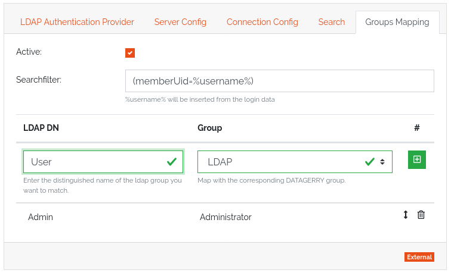

**************
Authentication
**************

DATAGERRY uses a hybrid authentication method for issuing access tokens. These tokens can be used to
authenticate against the Rest API.

When logging in, the user is searched in the database using his user name.
If a user is found, his stored provider is requested. Depending on the provider implementation, an authentication
is now attempted using the submitted password. If the authentication is successful, the provider
returns a user instance which is used to generate a valid access token. If the authentication fails, the login is aborted.

If no user is found in the database, each provider is called according to the provider order.
If a successful authentication takes place, a new user is created with the submitted login data and
stored in a predefined group. If no provider confirms a successful request, the login is aborted.

Access Token
============

Authentication uses JSON Web Tokens as specified in RFC 7519 for identity verification.
The `Issuer`, `Issued at`, `Expiration time` and the custom `DATAGERRY` claims are used.

.. warning::
    The asymmetrical RSA key for signing the tokens is stored in the database under **settings.conf**.

Providers
=========

Providers are authenticators who can locate a user in the system using a username and password.
They are divided into internal and external providers. In the case of internal providers,
the system searches for the user in the database.
External providers identify the user in an external third party system.

Preinstalled providers are:

1. **LocalAuthenticationProvider** - Searches for users in the database by username and compares the password with the stored SHA256 HMAC.
2. **LdapAuthenticationProvider** - Using the user name, tries to find a user in the directory service and authenticate with the password.

.. note::
    The order in which the providers are queried is determined by the installation order of the
    providers in the authentication module. A special factor here is that the local provider is always in
    first place.

LDAP group mapping
------------------
The LDAP authentication provider offers the possibility to create a mapping to the
datagerry groups based on the LDAP groups. Since Datagerry does not allow users to be assigned to multiple groups,
the possibility of multiple LDAP groups must be reduced.

The mapping of groups must first be activated manually. If mapping is disabled, all LDAP users are assigned to the
default group. This is also the case if the mapping is deactivated afterwards.

After activating the mapping, a search filter can be created for selecting the groups at login.
In the configuration interface you can now assign a group name of the LDAP to a datagerry group.
Here an LDAP group can be assigned exactly to one datagerry group, however different LDAP groups can be assigned to
the same datagerry group.

The order of the mappings is important. If a LDAP user appears in several mappings,
the first successful mapping is taken. If the user cannot be found in any mapping, he will be moved to the
default group.