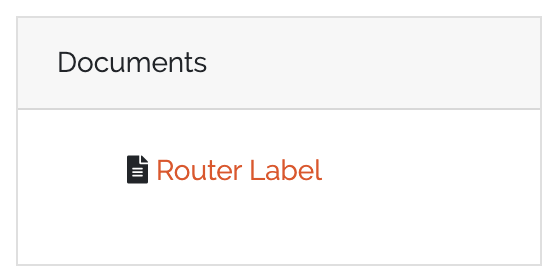

*******
DocAPI
*******

Concept
=======
DocAPI is an interface for generating PDF documents out of CMDB data. A user can design a Document Template in the
frontend. Each Document Template consists of the following elements:

 * Template Type
 * Template Content
 * Template Styling

The Template Type defines the kind of the template. For example the Object Template type generates documents for single
CMDB objects. Each Template Type may have its own configuration settings. For Object Templates, an object type needs to
be configured.

In the Template Content section, the document itself can be designed with an WYSIWYG editor. Depending on the chosen
Template Type, template variables can be used at all places of the document. These variables will then be replaced when
rendering the document for a specific object. The Template Content will be saved as HTML string in the background. So,
if you have advanced HTML skills, you may edit the HTML source directly in the editor.

The Template Styling section allows the definition of some custom styling with CSS. In this section, custom fonts or the
paper format can be defined for example.

When rendering a Document Template, the template variables in the content HTML will be replaced with its values (we use
Jinja2 as template engine). After that, the HTML and CSS will be put together and a PDF will be generated with the
`xhtml2pdf <https://xhtml2pdf.readthedocs.io/en/latest/>`_ library.

Required Permissions
====================
To add/edit/delete Document Templates, the following permissions needs to be set for a user group::

    base.docapi.template.view
    base.docapi.template.add
    base.docapi.template.edit
    base.docapi.template.delete

The default admin group should have a general permission which includes all the permissions noted above, if you did not
change the default configuration.

To render Document Templates, the following permission is required::

    base.docapi.template.view

The default user group should have this permission, if you did not change the default configuration.

.. note::
    If you upgrade from an older version, the new permissions were not set for existing user groups for security reasons.
    Please add the base.docapi.template.view permissions manually to user groups, which should render documents.

Configuration
=============

Document Templates can be configured in the WebUI under "DocAPI" -> "Document Templates". Add a new template or edit an
existing one. A wizzard will guide you through the configuration process.

At first, choose an unique label and name for your Document Template. 

In a second step, choose a Template Type and set the corresponding parameters. You can find a description of all
available Template Types in the Template Types section below.

After that, design your document in an WYSIWYG editor. Use the *CMDB Data* button to add appropriate template variables
or barcodes. You can also edit the HTML source code for advanced styling.

The last step enables the definition of custom CSS options for advanced styling. Leave it empty, if you do not want to
change the styling. For some Advanced Styling tips, see the *Advanced Styling* section below.

Template Types
==============

.. note::
    Currently only one Template Type is supported, but we'll add further Template Types in future versions of DATAGERRY.

Object Template
---------------
An Object Template generates a PDF document for a single CMDB object. All available documents are shown on the object
view page of a specific object in a little box: 

The following parameters needs to be set for an Object Template:

.. csv-table::
    :header: "name", "required", "description"
    :align: left

    "Object Type", "True", "type of the object for defining a template"

The following template variables can be used::

    # access the ID of the current object
    {{id}}
    
    # access the field "hostname" of the current object
    {{fields["hostname"]}}
    
    # dereference an object reference in field "location" (access the field "city" of the referenced object)
    # max 3 levels were dereferenced
    {{fields["location"]["fields"]["city"]}}

.. note::
    If you access object fields, use the name of the field instead of the label.

Advanced Styling
================
You can tune the styling of your document by adding some custom CSS to your template. The following section will show
some examples for custom styling. For further information about custom styling, please have a look at the documentation
of the `xhtml2pdf <https://xhtml2pdf.readthedocs.io/en/latest/>`_ library, which we use in the background for generating
PDFs out of HTML/CSS.

Page Format
-----------
The default page format is *A4 portrait* with a margin of *2cm*. To customize the paper format, have a look at the
following example CSSs:

.. code-block:: css

    @page {
        // page size and orientation: 
        // a0-a6 portrait or landscape
        size: a6 landscape;

        //margin
        margin-top: 2cm;
        margin-bottom: 2cm;
        margin-left: 2cm;
        margin-right: 2cm;
    }

.. code-block:: css

    @page {
        //page size can also be defined in mm
        size: 80mm 60mm;
    }

Custom Fonts
------------
To use custom fonts, please make them available to the DATAGERRY server via HTTP. With the @font-face keyword, the font
can be embedded and used in CSS for styling (e.g. for the p-tag):

.. code-block:: css

    @font-face {
        font-family: 'RalewayRegular';
        src: url('http://127.0.0.1:8000/Raleway-Regular.ttf');
    }
    
    p {
        font-family: 'RalewayRegular';
    }
