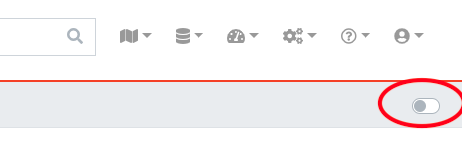
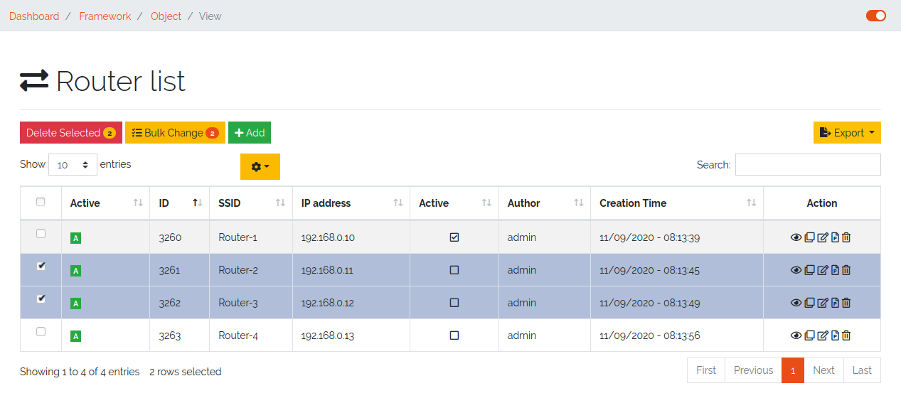
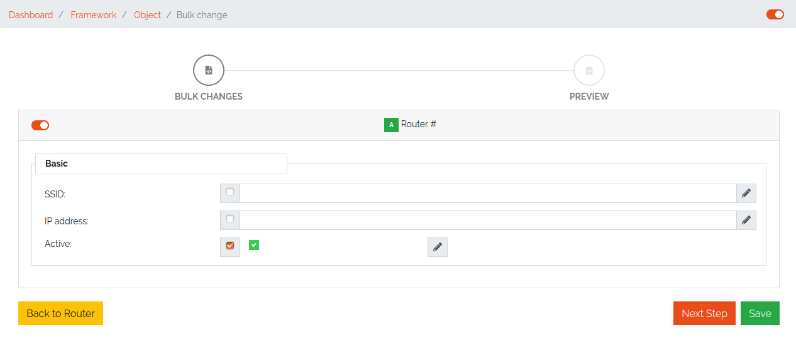
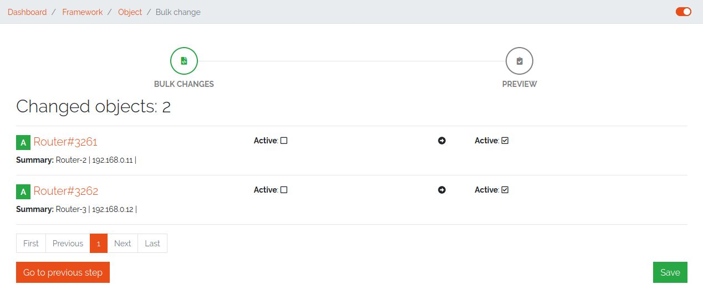
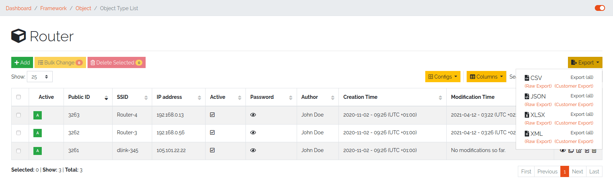
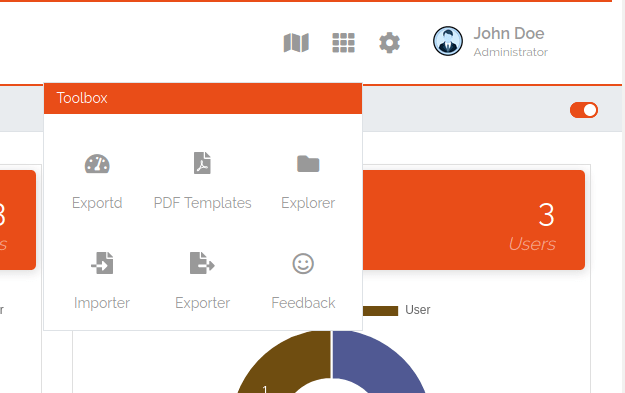
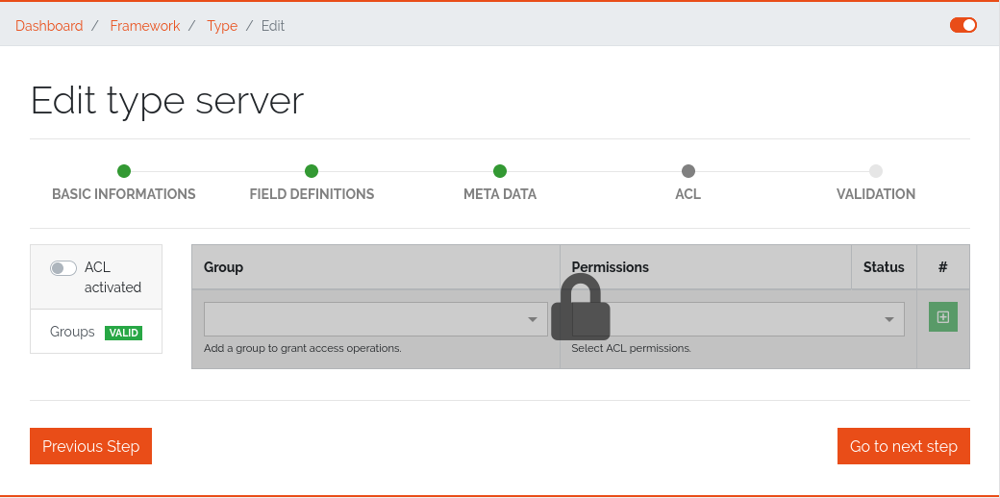
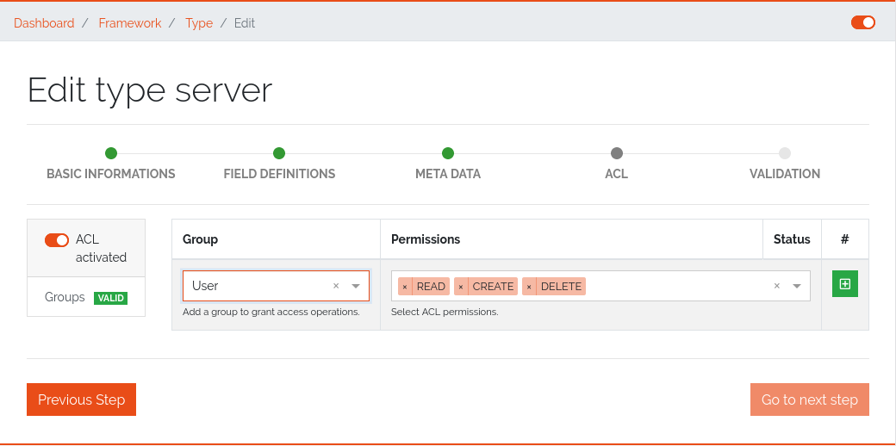
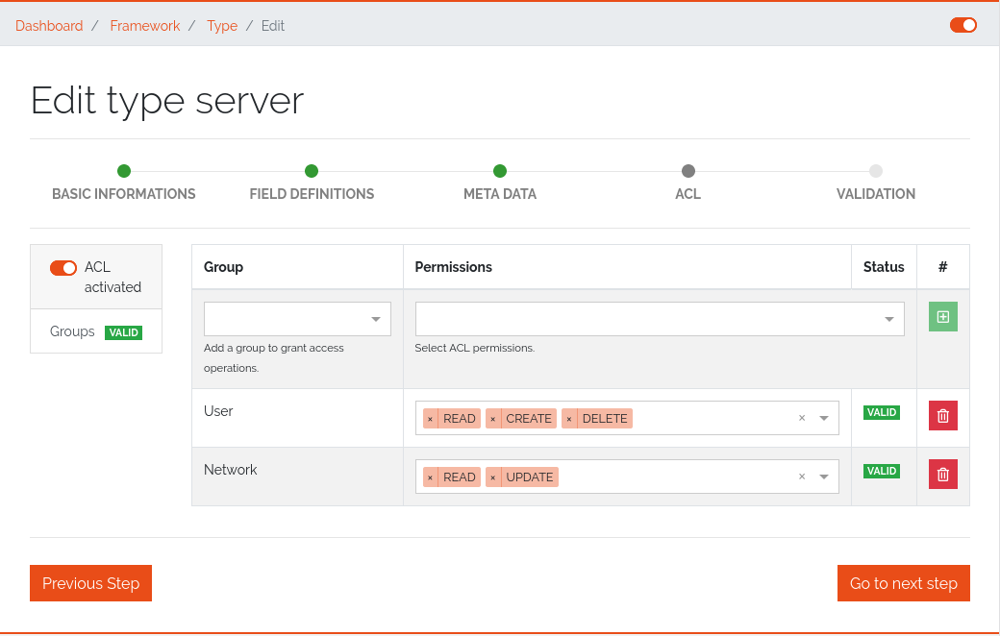

*********
Framework
*********

Managing Categories
===================

Object Types are organized in Categories. Categories can be managed under Framework -> Categories. Each Object Type is
assigned to one Category. Categories can be organized hierarchically, just define a parent Category. The tree of
Categories and their assigned Object Types are displayed on the sidebar on the left side of DATAGERRY.

.. figure:: img/objects_categories_sidebar.png
    :width: 200

    Figure 1: Sidebar

Managing Object Types
=====================

To manage Object Types select Framework -> Types in the menu bar:

.. figure:: img/objects_menu_types.png
    :width: 300

    Figure 2: Type list overview

Adding/Editing an Object Type
-----------------------------
In the Object Type list click on "Add" to add a new type, or click on the "Edit" icon to edit an existing type. A
wizzard will guide you through the process.

At first, some basic information about the type will be asked:

.. figure:: img/objects_type_basic.png
    :width: 600

    Figure 3: Add a new type

Choose a label and icon for the Object Type, that will be shown in the frontend. The name of the Object Type will be 
created automatically and cannot be changed and is only for internal use. Each Type is connected with a category. With
the exception of name, each setting on this page can be changed at any time.

The next step is the definition of the object fields see the following figure 4:

.. figure:: img/objects_type_fields.png
    :width: 600

    Figure 4: Definition of the object fields

Fields are organized in "Sections". To add a new section or field, choose an element from the left side box and move it
to the center with drag and drop. At first, add a section (you find it under "Structure Controls"), after that, choose
one or more fields. Each field or section has a name and label. A name will be created automatically and cannot be
changed manually, while a label can be changed at any time. Depending on the field type, several options can be set.
Currently we support the following field types:

.. list-table:: Table 1: Supported field types
   :width: 100%
   :widths: 25 75
   :align: left
   :header-rows: 1

   * - Type
     - Description
   * - Text
     - A text field. Content validation with regular expression is possible
   * - Password
     - password field with integrated password generator and hiding of content
   * - Textarea
     - Textbox with multiple lines
   * - Checkbox
     - A boolean checkbox
   * - Radio
     - Selection between multiple options
   * - Select
     - Selection between multiple options with a dropdown menu
   * - Date
     - A Date string according to the date format (ISO 8601)
   * - Reference
     - Reference to another object of a specific type. E.g. connection between a router and a location object

With the yellow preview button, an example of an object with the current configuration will be shown.

On the next page on the configuration dialog, meta information can be set:

.. figure:: img/objects_type_meta.png
    :width: 600

    Figure 5: Meta information

Each object has summary fields. These fields summarize the object and are shown by default in object lists. On a router,
this could be a management ip and a hostname. The summary fields can be set under "Summary".
Also, external links can be set, which are shown on the object page to add a quick link to the webUI of another system.
An External Link has a name, a label, an icon and the link (URL) itself. In the link, use curved brackets to access
values of an object field.

Changing an existing Object Type
--------------------------------
Existing Object Types can be changed at any time, just edit the Object Type and add or remove fields or other details.
The Object Type definition will be applied to all existing objects, so if you remove a field, it will not be shown in
DATAGERRY anymore. The removed field still exists in the database and if you add the field again, you can access the old
content. To cleanup the database and sync Object Type definition with the database, click on the "Cleanup" button in the
object type list.

Importing/Exporting Object Types
--------------------------------
Object Types can be exported in JSON format. In the Object Types list, click on the yellow "Export" button to get a file
in JSON format. By default, all Object Types will be exported. If you only want to export specific types, select items
in the list and click on the "Export" button.

Object Types can also be imported from a JSON file. In the menu, choose "Type Import/Export" -> "Import Type" and upload
a JSON file with type definitions. During the import, you can choose, which types from the JSON file should be imported.

Managing Objects
================
You can access Objects in DATAGERRY in several ways:

 * using the Category tree on the left side
 * using the search bar at the top

When using the Category tree, you can choose an Object Type (e.g. router) and get a list with all objects of that type.
By default, only summary fields of an object are shown in the table, with the yellow settings button, additional fields
can be faded in.

Active und Inactive Objects
---------------------------
Objects in DATAGERRY can be active or inactive. Inactive Objects are hidden in the WebUI and were not exported to
external systems with Exportd. By default, all new created Objects in DATAGERRY are active. You can set an Object to
inactive by hitting the small switch on the Object view page.

If you want to see inactive Objects in the WebUI, click on the switch under the navigation bar.

    Figure 6: Active / Inactive objects switch

Object tables filter
---------------------------

The search / filter option in the tables provides the possibility to control the search / filtering in a table. The search / filtering is performed over all searchable columns.
If matching data is found in any column, then the entire row is matched and displayed in the result set.

.. note::
    Date values must be searched according to the following format:

    **Format**: *YYYY-MM-DDThh:mmZ*

    **Example**: *2019-12-19T11:02*

|

Bulk change of Objects
----------------------
The bulk change is a function in DATAGERRY with which several objects can be changed in one step
on the basis of change templates. With this change, the selected objects adopt the field values of the change template.

**Start**

Simply select all objects you want to change and click on the yellow button for mass changes above the list.

    Figure 7: Select objects for bulk change

**Template**

A change template is generated based on the assigned object type. The following change template is identical
to the creation of a regular object. Store all contents that you want to
transfer to the objects later and save your entries.

    Figure 8: Change template

**Preview**:

In the preview, all changes made are listed and can be adjusted again if necessary.

    Figure 9: Overview of changes

**Result**:

After a preview, the selected objects will be changed.

    Figure 10: Bulk change result

Exporting Objects
-----------------
Objects can be exported in several formats. Currently we support:

 * CSV
 * Microsoft Excel (xlsx)
 * JSON
 * XML

To export objects, click the "Export" button in an object list and select the desired format. Only objects of a single
type can be exported (therefore you will not find the "Export" button in a list with objects of multiple types).

    Figure 11: Export from object list overview

.. list-table:: Table 2: Supported export types
   :width: 100%
   :widths: 25 75
   :align: left
   :header-rows: 1

   * - Type
     - Description
   * - Raw Export
     - All fields of the objects are exported raw. This functionality makes it easier for the user to make some changes
       and import the changed data back into DATAGERRY.
   * - Customer Export
     - Only the fields selected by the user are exported. When using a quick filter in the table, only iltered objects
       are exported and only rendered fields are displayed instead of raw data.

| Export is also possible from the menu, select "Toolbox" -> "Exporter" -> "Objects".

    Figure 12: Export / Import via Toolbox

Importing Objects
-----------------
To import Objects, choose "Objects Import/Export" -> "Import Objects" from the menu. Currently we support the import of
the following file formats:

 * CSV
 * JSON

To start an import, upload a file and choose the file format. Depending on the format, you have to make some settings
before an import can start.

CSV Import
^^^^^^^^^^
During an import from a CSV file, a mapping of rows to object fields must be defined with a drag and drop assistent.
If the CSV file contains a header that matches the name of object fields, the mapping will be predefined in the WebUI.
Also object references can be resolved with "Foreign Keys". For example, router objects with a field "location" should
be imported. There are Location objects in DATAGERRY with a field "name", that contains an unique name of a Location
(e.g. FRA1). The CSV file with router Objects contains the unique location name. If you choose "foreign key:
location:name" in the mapping wizard, a reference to the correct Location object will be set during the import.

JSON
^^^^
DATAGERRY can import Objects from a JSON file. The JSON format correspond to the format that was created when exporting
Objects.

Access Control
==============
Datagerry uses multiple access controls to restrict the access to data and functions.
In addition to the :ref:`system-access-rights`. implemented by default at the user management level,
there is also the concept of the access control list. These are currently only implemented for the object level,
but will be extended to various sections of the core framework.
They should provide more precise setting options for accesses within already authorized levels/functions.

Access Control List
-------------------
The concept of ACL is basically very simple. They are, as the name suggests,
lists that have group references with certain permissions. In our case, the user group is stored there.
So if a user wants to get access via an ACL, this is only possible if the complete user group is listed in the ACL.
The permissions define which actions are granted to a group within an ACL.
This allows different operations to be defined even more precisely.

Permissions
^^^^^^^^^^^
By default, four permissions are possible:

- **Create** a resource
- **Read** a resource
- **Update** a resource
- **Delete** a resource

based on the four basic functions of persistent storage.
Further permissions can theoretically be added, but these are not planned at the moment.

ACL vs. System-Rights
^^^^^^^^^^^^^^^^^^^^^
The difference between the system rights and the ACL is that the ACL only improves the system rights
and makes the accesses more detailed. They are **not a replacement** for the rights, they only extend the restrictions.
Groups that do not have rights for certain actions (for example: viewing an object) cannot do this,
even if their group is explicitly listed in the respective ACL.

Object ACL
----------
The ACLs of the objects protect them from unauthorized access.
They are used to make objects accessible to certain user groups or to hide them.
This affects not only the view of the objects themselves, but any aspect of CRUD access to objects,
up to and including search, export, etc.

In principle, there are five different access situations to objects.

.. csv-table:: Table 3: Access situations
   :header: "Configuration", "Access"
   :width: 100%
   :widths: 50 50
   :align: left

   "No ACL defined", "Everyone has access to objects of this type"
   "ACL deactivated", "Everyone has access to objects of this type"
   "ACL enabled, but group not included", "No access to objects of this type"
   "ACL enabled and group included, but not the grant permission of the operation", "No access to objects of this type"
   "ACL enabled and group included and grant permission of the operation", "User group has access to objects of this type"

**Why additional protection of objects?**

Datagerry instances can be defined large and complex. In many companies there are different hierarchies and access
restrictions to different information areas. Until now, DATAGERRY only offered the possibility to give groups
general read/view rights to objects, but not to make individual groups of objects visible only to certain user groups.
Here the ACL help to restrict or allow the visibility of object information for certain user groups
depending on the configuration.

Configure Object ACL
^^^^^^^^^^^^^^^^^^^^
Object ACL are defined in the respective type definitions via the type builder.
These can be defined under the ACL step based on the type. By default, they are disabled and the menu is excluded.

    Figure 13: Deactivated object acl

When activated, the menu is enabled and groups can be added to an ACL with the respective permissions.

    Figure 14: While object acl configure

After adding the groups, they are displayed in the list below and their permissions can be edited further.
But a group can only appear once in an ACL.
Listing the same group with different permissions in the same list is not possible.

    Figure 15: Inserted object acl

The ACL settings are retained at the object level even after the ACL is disabled, but then they are no longer applied.