*********
Framework
*********
This page contains a detailed overview and usage manuals for the core components of DATAGERRY. The three main
main components are **Categories**, **Types** and **Objects** which interact in the following way:

.. note::
  | A **Type** contains sections with fields which are used to describe an object from the real world.
  | An **Object** is an instance of a **Type** with concrete values.
  | A **Category** is used to group multiple **Types** to improve the overview.

=======================================================================================================================

| 

=======================================================================================================================

Managing Categories
===================
**Categories** are used to organize **Types** by grouping them. It is possible to structure **Categories**
hierarchically by defining an existing **Category** as a parent. To manage **Categories** go to
**Framework => Categories**.

| 

=======================================================================================================================

| 

Categories overview
-------------------
In the overview of **Categories** is the **"Category-Tree"** which displays the current structure of the **Categories**.
The **"Category-List"** displays all exisiting **Categories** with additional information like the PublicID or the
ParentID. At the top right corner two buttons to either create a new **Category** (**"+Add"**-Button) or to rearange the
exisitng **Categories**.

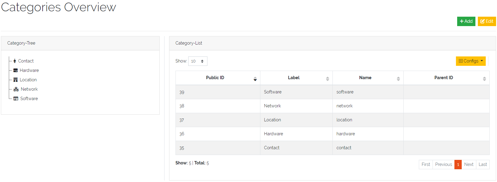

    Picture: Overview of **Categories**

| 

The tree of **Categories** and the assigned **Types** are displayed in the sidebar in the **"CATEGORIES"**-Tab on the
left side of DATAGERRY. Each **Type** which is not assigned to a **Category** will be displayed below in the 
**UNCATEGORIZED**-Section.

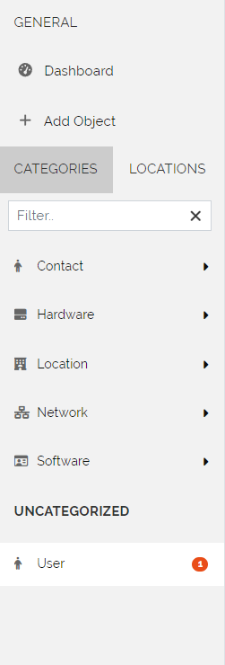

    Picture: Displayed **Categories** in the Sidebar of DATAGERRY

| 

=======================================================================================================================

| 

Create a Category
-----------------
To create a new **Category** press the **"+Add"**-Button in the **"Categories Overview"**. All unassigned **Types** are
displayed in the left overview **"Unassigned types"** and can be Drag/Dropped in the area **"Types"** in the
**"Basic information"** section. In the **"Basic information"**-Section it is poosible to set the following properties:

.. list-table:: Table: Fields for **Categories**
   :width: 60%
   :widths: 25 75
   :align: left
   :header-rows: 1

   * - Field
     - Description
   * - Name
     - A unique identifier for the **Category**
   * - Label
     - The displayed label of the **Category**
   * - Icon
     - The icon displayed in front of the **Category** (displayed in the sidebar)
   * - Parent
     - Select the top **Category** if this one should be a sub **Category**
   * - Types
     - Drag/Drop all **Types** in here which should be grouped by this **Category**

.. figure:: img/categories_add.png
    :width: 1000

    Picture: Adding a **Category**

| 

=======================================================================================================================

| 

Edit/Delete a Category
----------------------
To edit a **Category** press the **"Edit"**-Button in the top right corner of the **"Categories View"** which toggles
the **"Category-Tree"**-Section. Here it is possible to rearange the order of the **Categories** by Drag/Drop the
icon right of the **Category**-Label. The two actions after each **Category** allows it to either go to the
**"Edit"**-Form of the **Category** or delete it (by pressing the **"Trash Bin"**-Icon).

.. note::
    Deleting a **Category** will not delete the assigned **Types**.

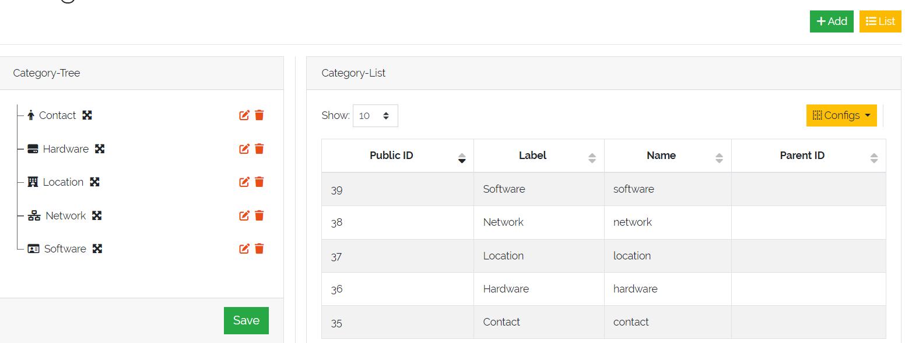

    Picture: Edit a **Category** in **"Category-Tree"**

| 

When editing a **Category** inside the **"Edit"**-Form it is also possible to rearange the order of the assigned
**Types** as well as modify the assigned **Types**.

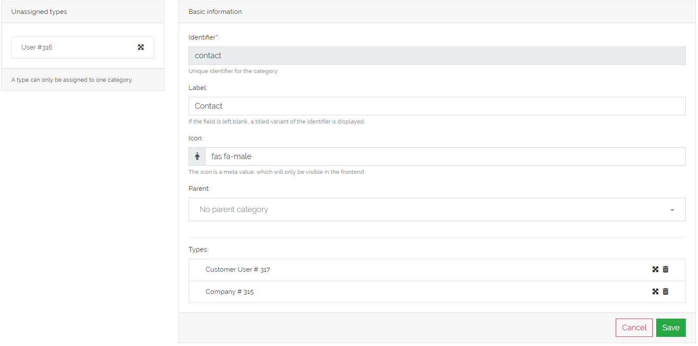

    Picture: Edit a **Category** in **"Edit"**-Form

=======================================================================================================================

| 

=======================================================================================================================

Managing Types
==============

To manage Object Types select Framework -> Types in the menu bar:

.. figure:: img/objects_menu_types.png
    :width: 300

    Figure 2: Type list overview

| 

=======================================================================================================================

| 

Adding/Editing a Type
---------------------
In the Object Type list click on "Add" to add a new type, or click on the "Edit" icon to edit an existing type. A
wizzard will guide you through the process.

At first, some basic information about the type will be asked:

.. figure:: img/objects_type_basic.png
    :width: 600

    Figure 3: Add a new type

Choose a label and icon for the Object Type, that will be shown in the frontend. The name of the Object Type will be 
created automatically and cannot be changed and is only for internal use. Each Type is connected with a category. With
the exception of name, each setting on this page can be changed at any time.

The next step is the definition of the object fields see the following figure 4:

.. figure:: img/objects_type_fields.png
    :width: 600

    Figure 4: Definition of the object fields

Fields are organized in “Sections” and "Reference Sections". To add a new section or field, choose an element from the
left side box and move it to the center with drag and drop. At first, add a 'section' or a 'reference section'
(you find it under “Structure Controls”), after that, choose one or more fields. Each field or section has a
name and label. A name will be created automatically and cannot be changed manually, while a label can be changed at
any time. Depending on the field type, several options can be set. Currently we support the following field types:

.. list-table:: Table: Supported field types
   :width: 80%
   :widths: 25 75
   :align: left
   :header-rows: 1

   * - Type
     - Description
   * - Text
     - A text field. Content validation with regular expression is possible
   * - Password
     - password field with integrated password generator and hiding of content
   * - Textarea
     - Textbox with multiple lines
   * - Checkbox
     - A boolean checkbox
   * - Radio
     - Selection between multiple options
   * - Select
     - Selection between multiple options with a dropdown menu
   * - Date
     - A Date string according to the date format (ISO 8601)
   * - Reference
     - Reference to another object of a specific type. E.g. connection between a router and a location object
   * - Reference Section
     - This binds a section with all fields of a referencing object completely as a display.

| 

=======================================================================================================================

| 

Special Controls
----------------
A "Reference" field type embeds a summary of a referencing object as a display.
The summary for each object definition is predefined in the type generator under the "Meta" tab. See Figure 7.
With the field type "Reference" it is possible to override the predefined summaries and make them user specific.
See Figure 5.

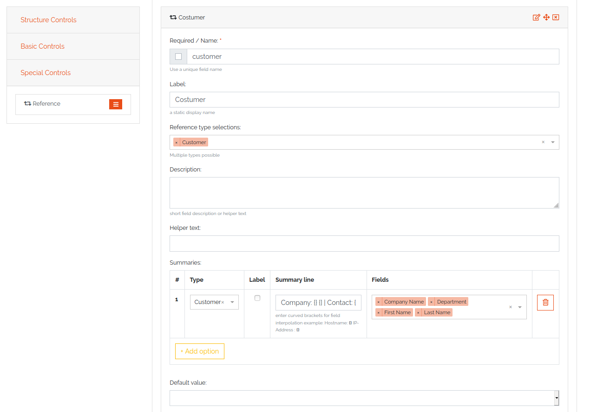

    Figure 5: Definition of the special fields

| 

=======================================================================================================================

| 

Reference Section
-----------------
A reference type "Section reference" binds a section with all fields of a referencing object completely as a display.
The search for the field values is run through like a normal field. The references are expanded accordingly,
so that a distinction is made between field references and section references.

.. figure:: img/object_reference_section_field.png
    :width: 600

    Figure 6: Definition of the object fields via reference section

On the next page on the configuration dialog, meta information can be set:

.. figure:: img/objects_type_meta.png
    :width: 600

    Figure 7: Meta information

Each object has summary fields. These fields summarize the object and are shown by default in object lists. On a router,
this could be a management ip and a hostname. The summary fields can be set under "Summary".
Also, external links can be set, which are shown on the object page to add a quick link to the webUI of another system.
An External Link has a name, a label, an icon and the link (URL) itself. In the link, use curved brackets to access
values of an object field.

| 

=======================================================================================================================

| 

Changing an existing Type
-------------------------
Existing Object Types can be changed at any time, just edit the Object Type and add or remove fields or other details.
The Object Type definition will be applied to all existing objects, so if you remove a field, it will not be shown in
DATAGERRY anymore. The removed field still exists in the database and if you add the field again, you can access the old
content. To cleanup the database and sync Object Type definition with the database, click on the "Cleanup" button in the
object type list.

| 

=======================================================================================================================

| 

Importing/Exporting Types
-------------------------
Object Types can be exported in JSON format. In the Object Types list, click on the yellow "Export" button to get a file
in JSON format. By default, all Object Types will be exported. If you only want to export specific types, select items
in the list and click on the "Export" button.

Object Types can also be imported from a JSON file. In the menu, choose "Type Import/Export" -> "Import Type" and upload
a JSON file with type definitions. During the import, you can choose, which types from the JSON file should be imported.

=======================================================================================================================

| 

=======================================================================================================================

Managing Objects
================
You can access Objects in DATAGERRY in several ways:

 * using the Category tree on the left side
 * using the search bar at the top

When using the Category tree, you can choose an Object Type (e.g. router) and get a list with all objects of that type.
By default, only summary fields of an object are shown in the table, with the yellow settings button, additional fields
can be faded in.

| 

=======================================================================================================================

| 

Active und Inactive Objects
---------------------------
Objects in DATAGERRY can be active or inactive. Inactive Objects are hidden in the WebUI and were not exported to
external systems with Exportd. By default, all new created Objects in DATAGERRY are active. You can set an Object to
inactive by hitting the small switch on the Object view page.

If you want to see inactive Objects in the WebUI, click on the switch under the navigation bar.

.. figure:: img/objects_active_switch.png
    :width: 300

    Figure 8: Active / Inactive objects switch

| 

=======================================================================================================================

| 

Object tables search / filter
-----------------------------

Searching a table is one of the most common user interactions with a DATAGERRY table, and DATAGERRY provides a number
of methods for you to control this interaction. There are tools for the table search(search) and for each individual
column (filter). Each search (table or column) can be marked as a regular expression (allowing you to create very complex
interactions).

| Please note that this method only applies the search to the table - it does not actually perform the search.

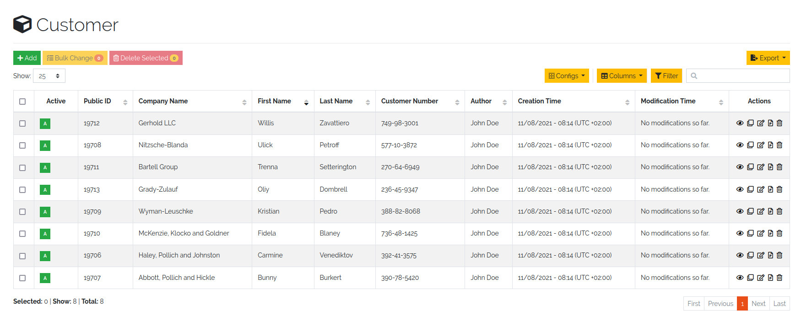

    Figure 9: Unfiltered object overview

| 

Table search
^^^^^^^^^^^^
The search option offers the possibility to check the results in a table.
The search is performed across all searchable columns. If matching data is found in a column,
the entire row is matched and displayed in the result set. See Figure 10: *Search result after searching for "B"*

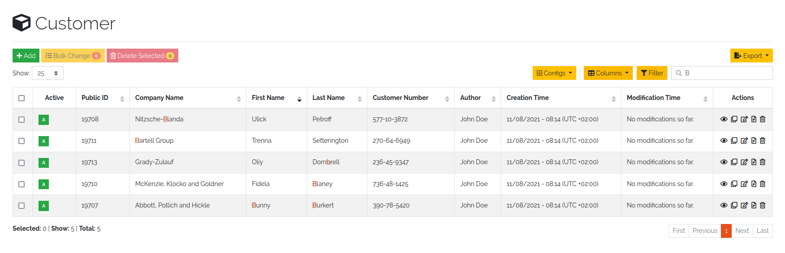

    Figure 10: Search result after searching for "B"

| 

Table filter
^^^^^^^^^^^^
While the search function offers the possibility to search the table,
the filter method provides the ability to search for data in a specific column.

The column searches are cumulative, so additional columns can be inserted to apply multiple individual column searches,
presenting the user with complex search options.

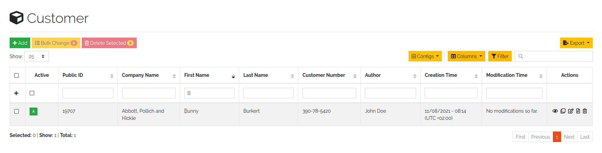

    Figure 11: Filter result after filtering for "B"

The search terms within different rows are linked with each other with the condition *OR* (Figure 12: *Filtering by OR-expression*).
The search terms within a row are all linked with the condition *AND* (Figure 13: *Filter by AND-expression*).
Only the filtered objects are available for exporting the values from the current table.

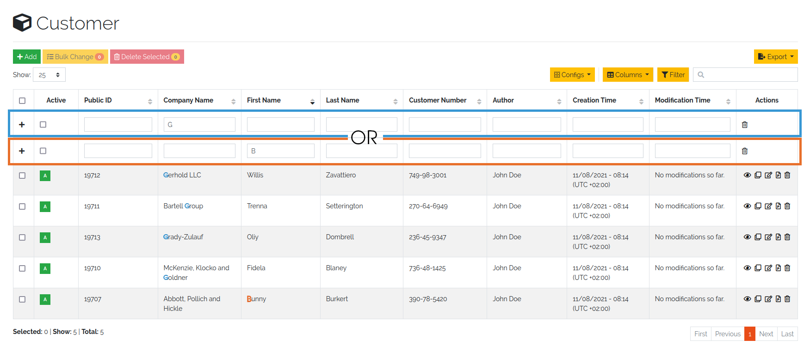

    Figure 12: Filtering by OR expression

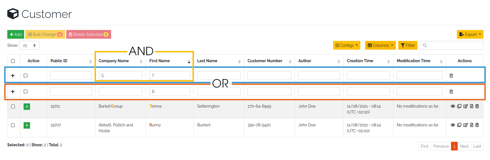

    Figure 13: Filtering by AND expression

|

.. note::
    Date values must be searched according to the following format:

    **Format**: *YYYY-MM-DDThh:mmZ*

    **Example**: *2019-12-19T11:02*

| 

=======================================================================================================================

| 

Bulk change of Objects
----------------------
The bulk change is a function in DATAGERRY with which several objects can be changed in one step
on the basis of change templates. With this change, the selected objects adopt the field values of the change template.

**Start**

Simply select all objects you want to change and click on the yellow button for mass changes above the list.

.. figure:: img/objects_bulk_change_list.png
    :width: 600

    Figure 14: Select objects for bulk change

**Template**

A change template is generated based on the assigned object type. The following change template is identical
to the creation of a regular object. Store all contents that you want to
transfer to the objects later and save your entries.

.. figure:: img/objects_bulk_change_active.png
    :width: 600

    Figure 15: Change template

**Preview**:

In the preview, all changes made are listed and can be adjusted again if necessary.

.. figure:: img/objects_bulk_change_preview.png
    :width: 600

    Figure 16: Overview of changes

**Result**:

After a preview, the selected objects will be changed.

.. figure:: img/objects_bulk_change_list.png
    :width: 600

    Figure 17: Bulk change result

| 

=======================================================================================================================

| 

Exporting Objects
-----------------
Objects can be exported in several formats. Currently we support:

 * CSV
 * Microsoft Excel (xlsx)
 * JSON
 * XML

To export objects, click the "Export" button in an object list and select the desired format. Only objects of a single
type can be exported (therefore you will not find the "Export" button in a list with objects of multiple types).

.. figure:: img/raw-custom-export.png
    :width: 600

    Figure 18: Export from object list overview

.. list-table:: Table 2: Supported export types
   :width: 100%
   :widths: 25 75
   :align: left
   :header-rows: 1

   * - Type
     - Description
   * - Raw Export
     - All fields of the objects are exported raw. This functionality makes it easier for the user to make some changes
       and import the changed data back into DATAGERRY.
   * - Customer Export
     - Only the fields selected by the user are exported. When using a quick filter in the table, only iltered objects
       are exported and only rendered fields are displayed instead of raw data.

| Export is also possible from the menu, select "Toolbox" -> "Exporter" -> "Objects".

.. figure:: img/object-import-export.png
    :width: 300

    Figure 19: Export / Import via Toolbox

| 

=======================================================================================================================

| 

Importing Objects
-----------------
To import Objects, choose "Objects Import/Export" -> "Import Objects" from the menu. Currently we support the import of
the following file formats:

 * CSV
 * JSON

To start an import, upload a file and choose the file format. Depending on the format, you have to make some settings
before an import can start.

| 

CSV Import
^^^^^^^^^^
During an import from a CSV file, a mapping of rows to object fields must be defined with a drag and drop assistent.
If the CSV file contains a header that matches the name of object fields, the mapping will be predefined in the WebUI.
Also object references can be resolved with "Foreign Keys". For example, router objects with a field "location" should
be imported. There are Location objects in DATAGERRY with a field "name", that contains an unique name of a Location
(e.g. FRA1). The CSV file with router Objects contains the unique location name. If you choose "foreign key:
location:name" in the mapping wizard, a reference to the correct Location object will be set during the import.

| 

JSON
^^^^
DATAGERRY can import Objects from a JSON file. The JSON format correspond to the format that was created when exporting
Objects.

=======================================================================================================================

| 

=======================================================================================================================

Access Control
==============
Datagerry uses multiple access controls to restrict the access to data and functions.
In addition to the :ref:`system-access-rights`. implemented by default at the user management level,
there is also the concept of the access control list. These are currently only implemented for the object level,
but will be extended to various sections of the core framework.
They should provide more precise setting options for accesses within already authorized levels/functions.

| 

=======================================================================================================================

| 

Access Control List
-------------------
The concept of ACL is basically very simple. They are, as the name suggests,
lists that have group references with certain permissions. In our case, the user group is stored there.
So if a user wants to get access via an ACL, this is only possible if the complete user group is listed in the ACL.
The permissions define which actions are granted to a group within an ACL.
This allows different operations to be defined even more precisely.

| 

Permissions
^^^^^^^^^^^
By default, four permissions are possible:

- **Create** a resource
- **Read** a resource
- **Update** a resource
- **Delete** a resource

based on the four basic functions of persistent storage.
Further permissions can theoretically be added, but these are not planned at the moment.

| 

ACL vs. System-Rights
^^^^^^^^^^^^^^^^^^^^^
The difference between the system rights and the ACL is that the ACL only improves the system rights
and makes the accesses more detailed. They are **not a replacement** for the rights, they only extend the restrictions.
Groups that do not have rights for certain actions (for example: viewing an object) cannot do this,
even if their group is explicitly listed in the respective ACL.

| 

=======================================================================================================================

| 

Object ACL
----------
The ACLs of the objects protect them from unauthorized access.
They are used to make objects accessible to certain user groups or to hide them.
This affects not only the view of the objects themselves, but any aspect of CRUD access to objects,
up to and including search, export, etc.

In principle, there are five different access situations to objects.

.. csv-table:: Table 3: Access situations
   :header: "Configuration", "Access"
   :width: 100%
   :widths: 50 50
   :align: left

   "No ACL defined", "Everyone has access to objects of this type"
   "ACL deactivated", "Everyone has access to objects of this type"
   "ACL enabled, but group not included", "No access to objects of this type"
   "ACL enabled and group included, but not the grant permission of the operation", "No access to objects of this type"
   "ACL enabled and group included and grant permission of the operation", "User group has access to objects of this type"

**Why additional protection of objects?**

Datagerry instances can be defined large and complex. In many companies there are different hierarchies and access
restrictions to different information areas. Until now, DATAGERRY only offered the possibility to give groups
general read/view rights to objects, but not to make individual groups of objects visible only to certain user groups.
Here the ACL help to restrict or allow the visibility of object information for certain user groups
depending on the configuration.

| 

Configure Object ACL
^^^^^^^^^^^^^^^^^^^^
Object ACL are defined in the respective type definitions via the type builder.
These can be defined under the ACL step based on the type. By default, they are disabled and the menu is excluded.

.. figure:: img/object_type_builder_acl_protected.png
    :width: 600
    :alt: Deactivated object acl

    Figure 20: Deactivated object acl

When activated, the menu is enabled and groups can be added to an ACL with the respective permissions.

.. figure:: img/object_type_builder_acl_setup.png
    :width: 600
    :alt: While object acl configure

    Figure 21: While object acl configure

After adding the groups, they are displayed in the list below and their permissions can be edited further.
But a group can only appear once in an ACL.
Listing the same group with different permissions in the same list is not possible.

.. figure:: img/object_type_builder_acl_example.png
    :width: 600
    :alt: Inserted object acl

    Figure 22: Inserted object acl

The ACL settings are retained at the object level even after the ACL is disabled, but then they are no longer applied.

=======================================================================================================================

| 

=======================================================================================================================

Locations
=========
**Locations** give users the possibility to structure their objects in a tree like shape where the top elements are for
example a country or a city and the sub elements are something like offices, rooms, servers etc. This will enhance the
overview as well as give the possibility to quickly find an object. The location tree can be found in the sidebar
inside the “LOCATIONS”-Tab.

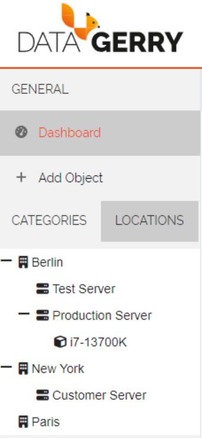

    Picture: Locations tab in sidebar

| 

=======================================================================================================================

| 

Initialise Location-Functionality for a Type
--------------------------------------------
In order to display **Objects** in the Locations-Tab the corresponding **Type** needs to have assigned the Special
Control **Location** in it's type configuration. To do this open the type overview via **Framework => Types** in the
top right corner and press the **Edit**-Icon from the **Actions**-column for the **Type** which should get the
**Locations** functionality. 

In the type configuration switch to the **Content**-Tab and on the left side in **Special Controls** drag the
**Location**-Control inside the fields-area of a section.

.. note::
  A **Location-Control** can only be assigned once to a **Type**.

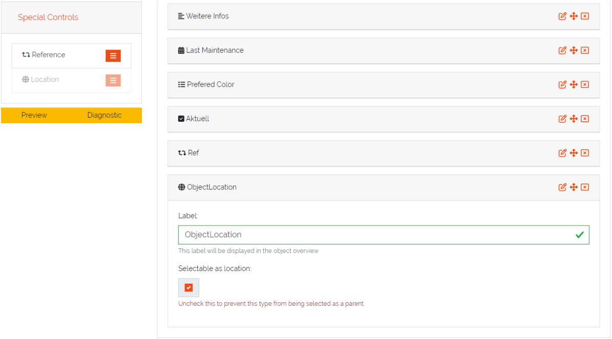

    Picture: Location control in type configuration

The **Location**-Control contains two fields, “Label” and “Selectable as Location”. The “Label” is used in the object
overview to identify the location field and the “Selectable as Location” defines if this type can be used as a top
location for other objects .This is useful if you have a type where you don't want the have any objects below it,
for example you have a **Type** Server and a **Type** Processor. The server is the top location for the processor but
the processor can not be the top location for any other **Types**.

| 

=======================================================================================================================

| 

Configure a Location for an Object
----------------------------------

After the **Location**-Special Control has been added to the **Type**(see previous step) switch to the object overview
of an **Object** of this **Type**. The **Location**-Special Control added two fields to the **Object**. The first is
the location selection named after the "Label" which was set in the type configuration. In this field the top location
for this **Object** can be selected.The drop down list contains always the **Root**-Location which is the top most
**Location** possible. Furthermore the drop down will also contain all **Objects** which have a **Location** selected
(but not **Objects** which are directly below the current object in the **Location Tree**).

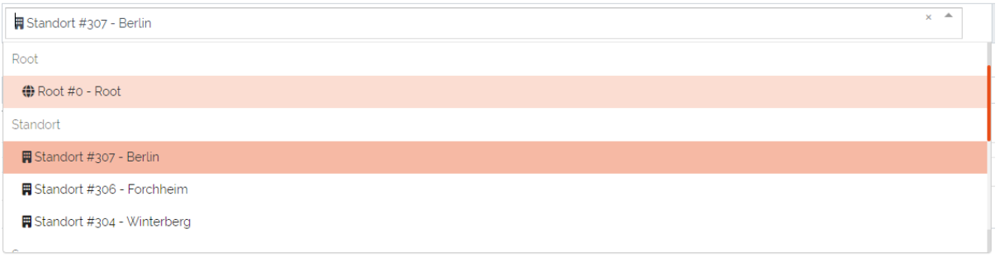

    Picture: Selection of top location for current location

| 

The second added field "Label in location tree" is used to set the name of this **Object** when displayed in the
**Location tree**.

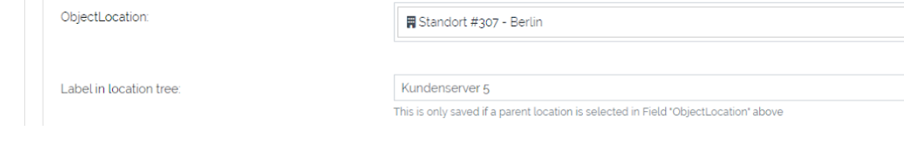

    Picture: Added fields to **Object** from **Location**-Special Control

| 

When the top location is selected and the **Object** is saved it will appear in the **Locations**-Tab in the sidebar.
Each **Object** in the **Locations**-Tab can be clicked and will open the object overview of the selected **Object**.

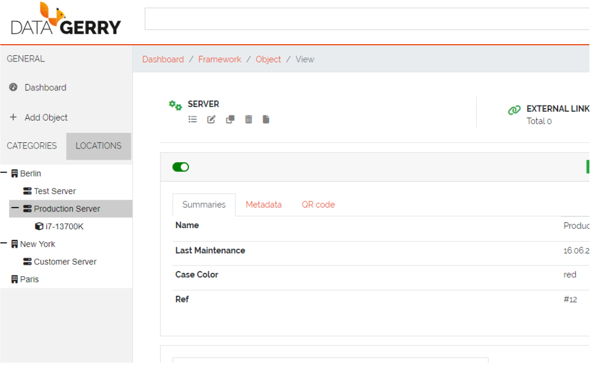

    Picture: **Locations** in the **Locations**-Tab

=======================================================================================================================

| 

=======================================================================================================================

Section templates
=================
Section templates give users the ability to build custom sections and insert them via  drag and drop in type
configurations. This is useful when the same group of fields(a section) is used for diffent types. Section templates
speed up the creation and modification of types as well as remove the need to create recurring sections
for types over and over again.

Section templates can be accessed at the top right corner at **Framework => Section Templates**.

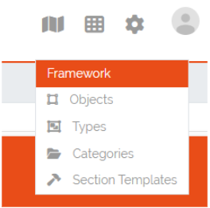

    Picture: Accessing Section Templates

| 

=======================================================================================================================

| 

Section Templates Overview
--------------------------
In the Section Templates overview all created templates are displayed with their PublicID, Name, Type and 
the corresponding actions. At the top left corner of the table is the “Add”-Button with which new section
templates can be created.

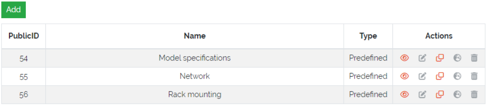

    Picture: Section Templates overview

| 

=======================================================================================================================

| 

Creating Section Templates
--------------------------
In this form a section template can be built the same way as in type configurations by drag and drop of elements
from the “Controls”-Sidebar into the “Fields”-area of the section. The only control that is not available to
section templates is the special control **Location** since a type can only have one of these controls and is
therefore only setable directly in the type configuration. Additionally there is a checkbox in the section header
where the template can be defined as a **Global** section template, this can not be changed when editing a section
template. If the checkbox remains unchecked the created section template will be of type **Standard**.

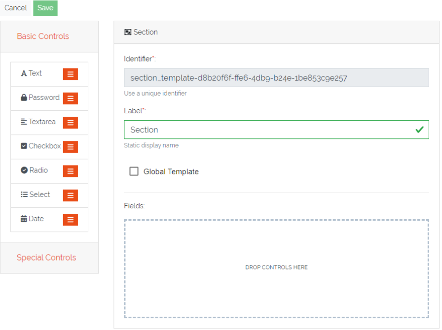

    Picture: Creation of Section Templates

| 

=======================================================================================================================

| 

Using Section Templates
-----------------------
After a section template has been created it can be used in type configurations. In the sidebar of the type
configuration are two areas, the **Global Section Templates** area  which contain all global and predefined
section templates and the **Section Templates** area which contains all Standard section templates. They can
be added to the type configuration via drag and drop the same way a new section would be added. **Global
Section Templates** are not editable inside the type configuration.

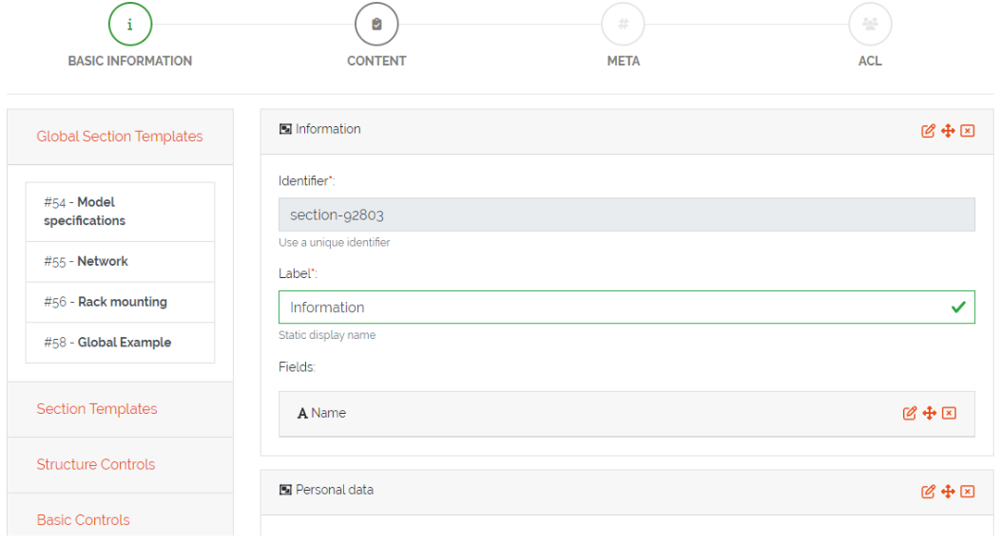

    Picture: Using section templates in type configuration

| 

=======================================================================================================================

| 

Section Template Types
----------------------
There are three different types of templates each with a specific purpose. Below is an overview of the
characteristics of each section template type.

| 

Standard Section Templates
^^^^^^^^^^^^^^^^^^^^^^^^^^
- It can be dropped multiple times inside the same type configuration
- After it is dragged inside the type configuration it can be further modified and additional fields can
  be added or existing ones can be deleted
- It can be converted into a **Global Section Template**
- Changing a standard section template in the template configuration won't affect already used instances of it
- There is no programatical connection between the **Standard Section Template** and the type

| 

Global Section Templates
^^^^^^^^^^^^^^^^^^^^^^^^
- It can be dropped only once inside the same type configuration
- It can not be further modified after it was added to a type configuration
- Changes to the global section template in the template configuration will affect all existing instances
  of the template

  - **Example 1:** Adding a field will add the new field to all existing instances of this template
  - **Example 2:** Removing a field will also remove this field from all existing instances of this 
    template (the stored value is lost)
  - **Example 3:** Deleting a global section template will also delete the section and its data from all types and
    objects which are using it

- Types are tracking all of their used **Global Section Templates**

| 

Predefined Section Templates
^^^^^^^^^^^^^^^^^^^^^^^^^^^^
- They have the same characteristics as **Global Section Templates** but are delivered by DATAGERRY
- They are not editable or deletable by the user
- Users can create a clone of **Predefined Section Templates** but the clone will no longer be considered
  as a predefined section template

| 

=======================================================================================================================

| 

Section Templates - Table Actions
---------------------------------
There are different actions for created section templates depending on the template type. Below is an overview
and explanation of each.

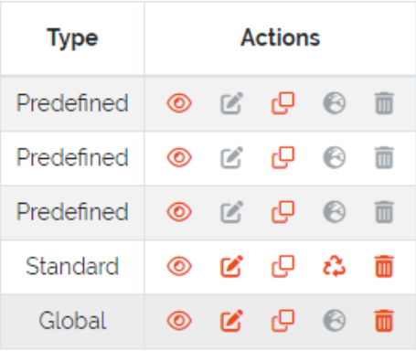

    Picture: Actions for created section templates

| 

**Open Preview** |action_preview_img|

Opens a preview of the section template which will display how the created section and its fields will look like.

| 

**Edit Section Template** |action_edit_img|

Redirects the user to the edit form for the section template. This action is not available for predefined templates.
Editing a global section template in this form will affect all types and objects using this template.

| 

**Clone Section Template** |action_clone_img|

With this action users can create a clone of an existing template(even a predefined template). A popup will open
where the name and the type of the template can be set. After confirmation the clone will be created.
A cloned predefined template is either of type standard or global.

| 

**Transform Standard Template** |action_transform_img|

A standard template can be transformed into a global section template by pressing this action. When the template
is transformed it is seen as a new global section template which means that the previous uses of this standard
template on types are not tracked. Users should consider that this action can not be undone. This action is only
available to standard templates.

| 

**Global Template Indicator** |action_global_img|

This is just an indicator that this template type is **Global** and should represent that this type can not be
transformed. All predefined templates are also global templates.

| 

**Delete Template** |action_delete_img|

With this action section templates can be deleted. Consider that deleting a global section template will also
remove it and all set values from types and objects. The amount of affected types and objects will be displayed
in the confirmation popup. Predefined templates are not deletable.

| 

=======================================================================================================================

| 

Section Templates - Rights
--------------------------
The section for managing **Section Templates** has its own set of rights.

| 

**base.framework.sectionTemplates.\***

This right grants all the rights mentioned below and allows the user to do everything with section templates.

| 

**base.framework.sectionTemplates.view**

This right is required to access the section templates via **Framework => Section Templates**. Furthermore it 
is required for the **Open Preview** action.

| 

**base.framework.sectionTemplates.create**

This right is required to create new section templates. Together with **base.framework.sectionTemplates.edit**
it is required to clone templates.

| 

**base.framework.sectionTemplates.edit**

This right is required to edit existing section templates. Together with **base.framework.sectionTemplates.create**
it is required to clone templates.

| 

**base.framework.sectionTemplates.delete**

This right is required to delete existing section templates. Predefined section templates are not deleteable.

| 