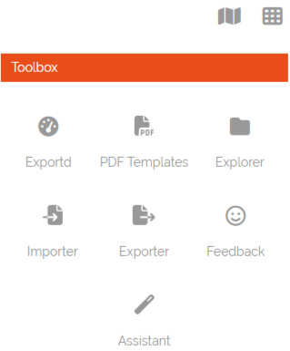
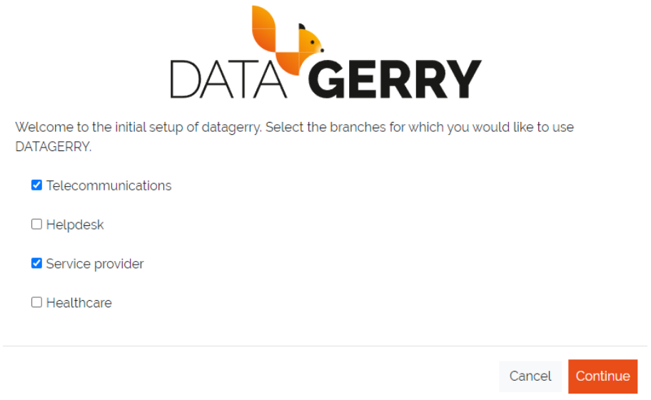
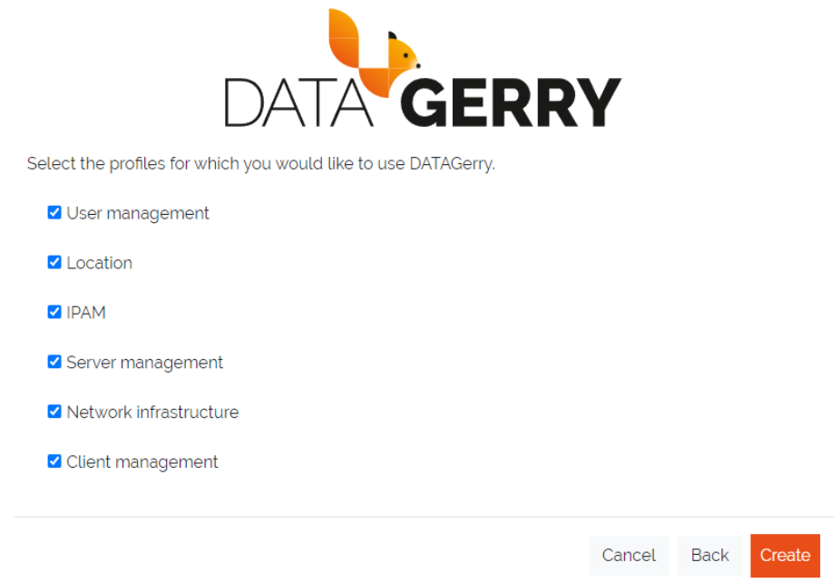
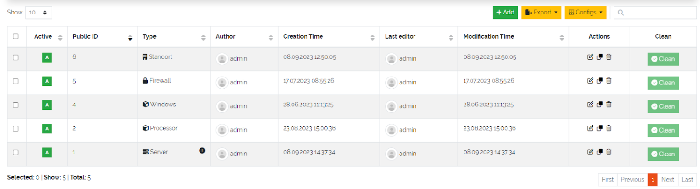
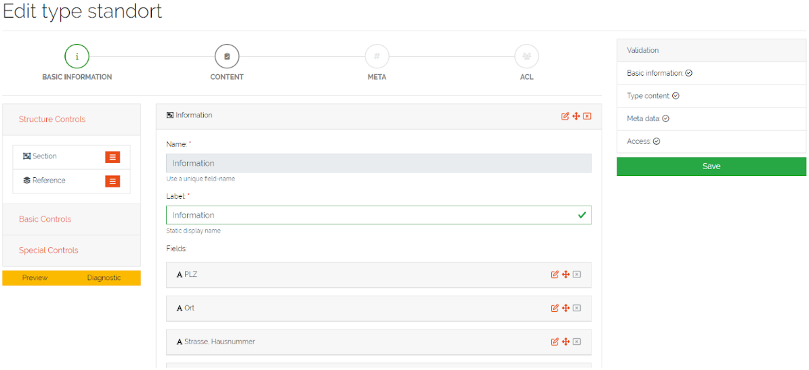

***************
Getting Started
***************

DATAGERRY is a versatile asset management tool (or CMDB) that empowers users to define their own data models and store
information in **Objects**. An **Object** represents entities such as routers, servers, locations, or maintenance
contracts, each comprising multiple fields (e.g., management IP, hostname of a router) with specific data types.
Examples of data types include text, checkbox, date, dropdown, and more, allowing for flexible and detailed
data management tailored to individual organizational needs.

In DATAGERRY, the blueprint for an **Object** is defined by a **Type**. Each **Type** dictates the following details
for all **Objects** belonging to it:

 * Fields and their respective data type
 * Sections to logically group fields
 * Type icon
 * Type name

The type definition can be modified at any time, even if **Objects** of that **Type** already exist.

.. note::
  For detailed guidance on how to use DATAGERRY, please refer to this link:
  :doc:`Basic Concepts of DATAGERRY </admin_guide/framework>`

| 

=======================================================================================================================

| 

DATAGERRY Assistant
===================
The **DATAGERRY Assistant** simplifies your introduction to DATAGERRY through straightforward steps. It automatically
launches the first time you start DATAGERRY. Alternatively, you can access it anytime by clicking on
**Toolbox => Assistant** in the top-right corner, allowing you to explore DATAGERRY independently before using the
Assistant.

    Picture: Assistant in Toolbox

| 

=======================================================================================================================

After launching the **DATAGERRY Assistant** , you will have the option to choose from various commonly used branches
typical of CMDBs. You can select multiple branches or even choose all of them.

    Picture: Branch selection

| 

=======================================================================================================================

After clicking the **"Continue"** - Button, several profiles will be displayed based on the selected branches. Each
profile includes a predefined set of types commonly used for these types of assets. Here, you can further customize
your requirements by selecting or deselecting profiles.

    Picture: Profile selection

| 

=======================================================================================================================

After clicking the **“Create”** - Button all **Types** from the selected profiles will be generated, and you will be
redirected to the type overview (accessible via **Framework => Types** in the top right corner). The newly created
**Types** will also appear in the sidebar, grouped by **Categories** based on the selected branches and profiles.

    Picture: Type overview table

| 

=======================================================================================================================

In the table, you can access the configurations of the created **Types** by clicking the **"Edit"** icon in the
**'Actions'** column. This allows you to gain a first impression of how **Types** are structured in DATAGERRY.
Additionally, you can create new **Types** by clicking the **"+Add"** button located above the table, enabling you to
customize DATAGERRY to meet your specific requirements.

    Picture: Type editing form

| 