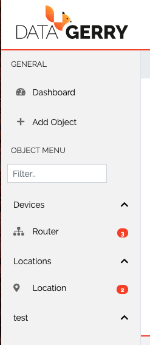
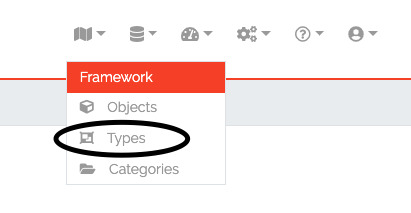
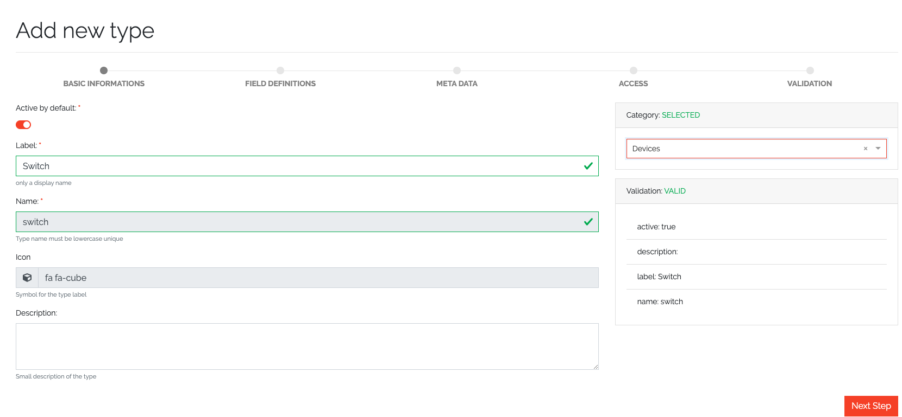
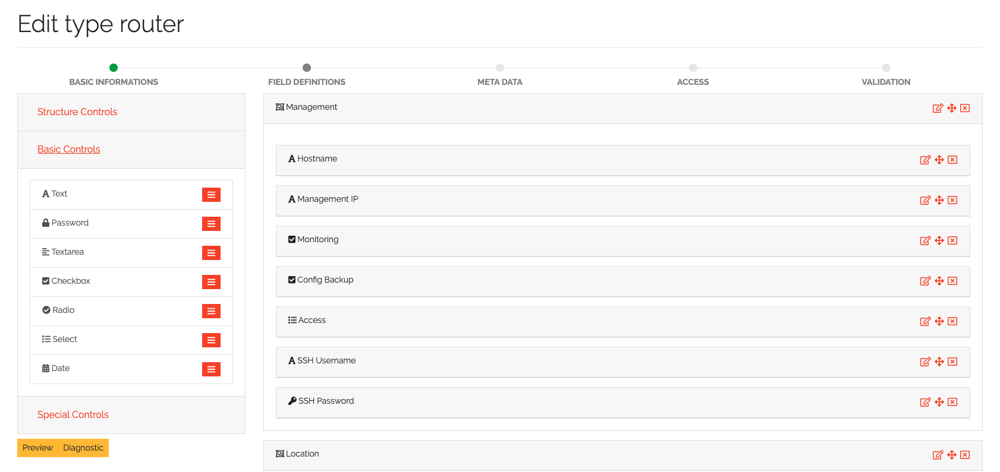
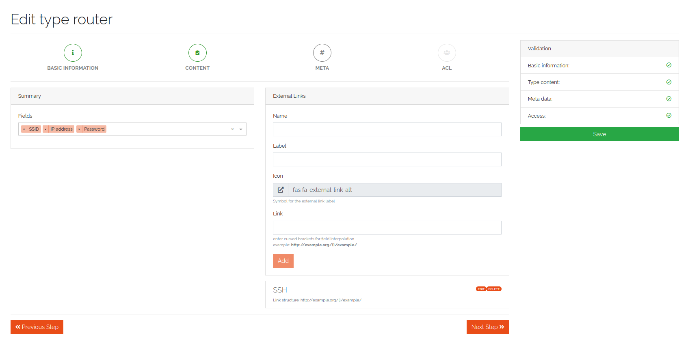

**************************
Objects and Object Types
**************************

Managing Categories
===================

Objects Types are organized in Categories. Categories can be managed under Framework -> Categories. Each Object Type is
assigned to one Category. Categories can be organized hierarchically, just define a parent Category. The tree of
Categories and their assigned Object Types is displayed on the sidebar on the left side of DATAGERRY.

Managing Object Types
=====================

To manage Object Types select Framework -> Types in the menu bar:

A list with defined object types will be shown.

Adding/Editing an Object Type
-----------------------------
In the Object Type list click on "Add" to add a new type, or click on the "Edit" icon to edit an existing type. A
wizzard will guide you through the process.

At first, some basic information about the type will be asked:

Choose a label and icon for the Object Type, that will be shown in the frontend. The name of the Object Type will be 
created automatically and cannot be changed and is only for internal use. Each Type is connected with a category. With
the exception of name, each setting on this page can be changed at any time.

As a next step, the object fields can be defined:

Fields are organized in "Sections". To add a new section or field, choose an element from the left side box and move it
to the center with drag and drop. At first, add a section (you find it under "Structure Controls"), after that, choose
one or more fields. Each field or section has a name and label. A name will be created automatically and cannot be
changed manually, while a label can be changed at any time. Depending on the field type, several options can be set.
Currently we support the following field types:

.. csv-table:: field types
    :header: "type", "description"
    :align: left

    "Text", "A text field. Content validation with regular expression is possible"
    "Password", "A password field with integrated password generator and hiding of content"
    "Textarea", "Textbox with multiple lines"
    "Checkbox", "A boolean checkbox"
    "Radio", "Selection between multiple options"
    "Select", "Selection between multiple options with a dropdown menu"
    "Date", "A datepicker"
    "Reference", "Reference to another object of a specific type. E.g. connection between a router and a location object"

With the yellow preview button, and example of an object with the current configuration will be shown.

On the next page on the configuration dialog, meta informations can be set:

Each object has summary fields. These fields summarize the object and are shown by default in object lists. On a router,
this could be a management ip and a hostname. The summary fields can be set under "Summary".
Also, external links can be set, which are shown on the object page to add a quick link to the webUI of another system.
An External Link has a name, a label, an icon and the link (URL) itself. In the link, use curved brackets to access
values of an object field.

Changing an existing Object Type
--------------------------------
Existing Object Types can be changed at any time, just edit the Object Type and add or remove fields or other details.
The Object Type definition will be applied to all existing objects, so if you remove a field, it will not be shown in
DATAGERRY anymore. The removed field still exists in the database and if you add the field again, you can access the old
content. To cleanup the database and sync Object Type definition with the database, click on the "Cleanup" button in the
object type list.
