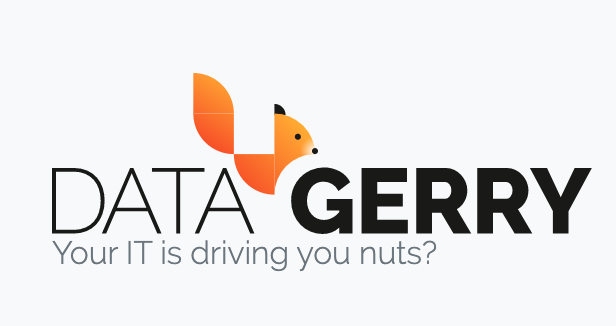

********************
Welcome to DATAGERRY
********************

| 

DATAGERRY is a powerful OpenSource Asset Management Tool and Configuration Management Database (CMDB) designed
to provide users with complete control over their data models. Unlike traditional asset management tools, DATAGERRY
does not impose predefined data structures, allowing users the flexibility to define and customize their own data
models according to their unique needs and organizational requirements. With its user-friendly interface and robust
features, DATAGERRY enables efficient tracking, managing, and analyzing of assets and configuration items, ensuring
accurate and up-to-date information for better decision-making and operational efficiency. Whether you're managing
IT assets, facilities, or other resources, DATAGERRY offers a versatile and scalable solution that adapts to your
evolving business needs.

| 

=======================================================================================================================

| 

If you need assistance, please refer to the following resources for support and information:

- `DATAGERRY Website <https://datagerry.com>`_
  
  Visit the official DATAGERRY website for comprehensive information about the tool and its features.

- `Professional Services <https://datagerry.com/professional-services/>`_
  
  Explore our professional services for expert guidance, custom solutions, and support tailored to your specific needs.

- `Community Support <https://community.datagerry.com>`_
  
  Join the DATAGERRY community forum to connect with other users, share experiences, ask questions, and find
  solutions collaboratively.

- `Source Code <https://github.com/DATAGerry/DATAGerry/>`_
  
  Access the DATAGERRY source code on GitHub to review the codebase and gain a deeper understanding of the tool.
